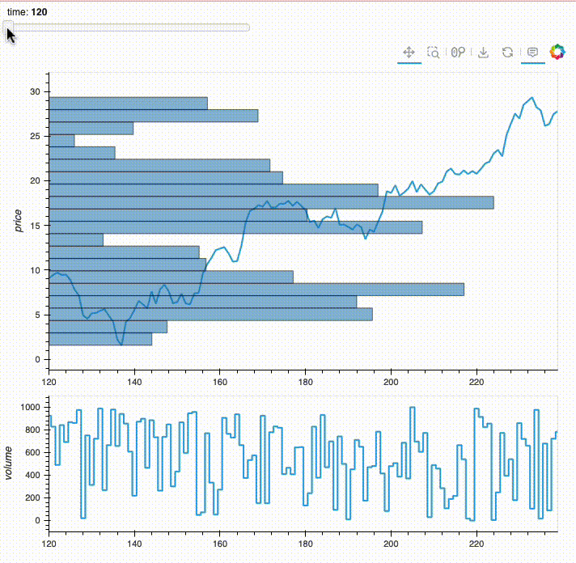

# polars_pbv: Polars Price by Volume (PBV) Extension
The Polars Price by Volume (PBV) extension is a powerful tool for analyzing and visualizing financial data. This extension provides various functions to calculate and visualize the price by volume (PBV) data using the Polars DataFrame library.

## Installation

To use the Polars PBV extension, you need to install the following packages:

	•	polars
	•	polars_pbv

You can install these packages using pip:
``` bash
pip install polars polars_pbv
```

If you want to visualize the pbv chart, you need to install the following packages:

	•	hvplot
	•	holoviews
	•	panel

You can install these packages using pip:
``` bash
pip install hvplot holoviews panel
```


## PBV Extension Functions

The PBV extension provides several functions:

	1.	pbv
	2.	pbv_pct
	3.	pbv_topn_vp
	4.	pbv_topn_v

### Function Definitions
#### pbv

Calculates the price by volume over a specified window size and bins.

``` python
def pbv(
    price: IntoExpr,
    volume: IntoExpr,
    window_size: int,
    bins: int,
    center: bool = True,
    round: int = -1,
) -> pl.Expr:
```

Return type will be the struct contain the key with price and volume and the value both list 

#### pbv_pct

Calculates the percentage price by volume over a specified window size and bins.

``` python
def pbv_pct(
    price: IntoExpr,
    volume: IntoExpr,
    window_size: int,
    bins: int,
    center: bool = True,
    round: int = -1,
) -> pl.Expr:
```

Same as above return type with the volume norm as percentage.

#### pbv_topn_vp

Calculates the top N price by volume over a specified window size and bins.

``` python
def pbv_topn_vp(
    price: IntoExpr,
    volume: IntoExpr,
    window_size: int,
    bins: int,
    n: int,
    center: bool = True,
    round: int = -1,
) -> pl.Expr:
```

Return will be list of price.

#### pbv_topn_v

Calculates the top N price by volume over a specified window size and bins, with an option to calculate percentages.

``` python
def pbv_topn_v(
    price: IntoExpr,
    volume: IntoExpr,
    window_size: int,
    bins: int,
    n: int,
    center: bool = True,
    round: int = -1,
    pct: bool = False,
) -> pl.Expr:
```

Return will be list of volume or volume norm as pct.

## Usage Example

### demo


Below is an example of how to use the Polars PBV extension. This example demonstrates how to calculate the PBV data and visualize it using hvplot and holoviews.

``` python
import numpy as np
import polars as pl
import polars_pbv as pl_pbv
import hvplot.pandas
import holoviews as hv
import panel as pn

# Initialize Panel extension
pn.extension()

# Define parameters
n = 1000
w = 120
b = 20

# Create a Polars DataFrame with example data
df = pl.DataFrame({
    "index": np.arange(0, n),
    "price": np.random.normal(size=n),
    "volume": np.random.randint(0, 1000, n),
}).with_columns(
    pl.col("price").cum_sum()
).with_columns(
    pl_pbv.pbv_pct("price", "volume", w, b, center=False).alias("pbv")
)

# Display the widget and the plot
i_slider = pn.widgets.IntSlider(name='i', start=0, end=n-w, step=1, value=0)

def plot_pbv(i):
    print(f"use {i}")
    df_pbv = df.slice(i+w, 1).select(
        pl.col("pbv").struct.field("price").list.explode(),
        pl.col("pbv").struct.field("volume").list.explode() * n,
    )
    pbv_data = df_pbv.to_dicts()
    step = pbv_data[1]["price"] - pbv_data[0]["price"]
    pbv_v_max = df_pbv["volume"].max()
    return ((df.slice(i, w).plot.line(x="index", y="price", height=400) * 
      hv.Rectangles([[i, r["price"], i + r["volume"], r["price"] + step] for r in pbv_data], ).opts(alpha=0.5)
     ) + df.slice(i, w).plot.step(x="index", y="volume", height=200)).cols(1)

interactive_plot = pn.bind(plot_pbv, i=i_slider)

# Create a dashboard with the slider and the plot
dashboard = pn.Column(i_slider, interactive_plot)
dashboard.servable()

# If running in a Jupyter notebook or JupyterLab
dashboard
```

This example demonstrates how to create a Polars DataFrame, calculate the PBV data, and visualize it using hvPlot and HoloViews. The interactive slider allows you to dynamically update the plot by changing the value of i.


